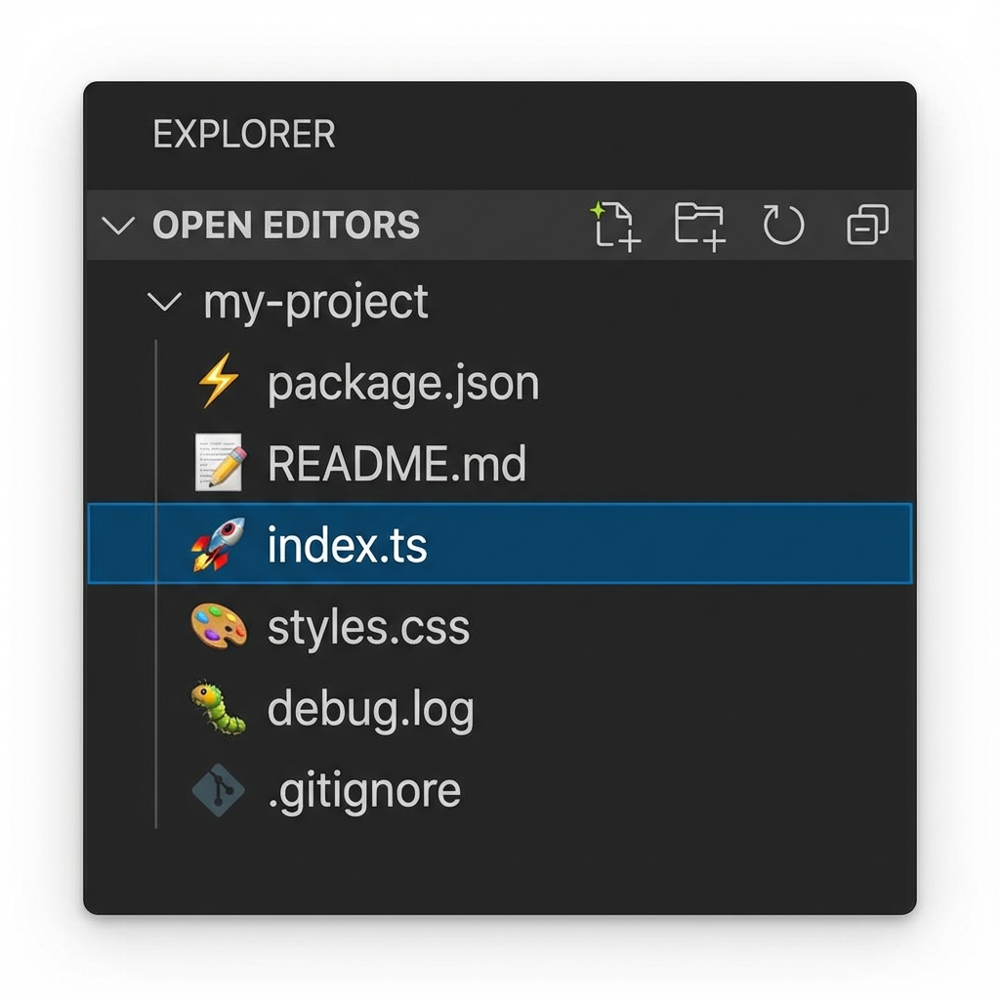

  
  <h1>Emoji File Markers</h1>
  

    <b>Mark and tag your files with emojis in the VS Code file explorer! 🎨</b>
  

  
  
  

   
  
   

## 📋 Table of Contents

- [Overview](#overview)
- [Features](#features)
- [Installation](#installation)
- [User Manual](#user-manual)
  - [Getting Started](#getting-started)
  - [Adding Emoji Markers](#adding-emoji-markers)
  - [Removing Emoji Markers](#removing-emoji-markers)
  - [Managing Markers](#managing-markers)
- [Available Emojis](#available-emojis)
- [Use Cases & Best Practices](#use-cases--best-practices)
- [Keyboard Shortcuts](#keyboard-shortcuts)
- [Commands Reference](#commands-reference)
- [Troubleshooting](#troubleshooting)
- [FAQ](#faq)
- [Known Limitations](#known-limitations)
- [Contributing](#contributing)
- [License](#license)

---

## Overview

**Emoji File Markers** is a VS Code extension that allows you to visually organize your workspace by adding emoji markers to files in the File Explorer. With 90+ carefully curated emojis, you can quickly identify file purposes, track status, mark priorities, and create a personalized file organization system.

## Features

✨ **Visual File Organization**: Mark files with emojis to quickly identify their purpose, status, or priority  
🖱️ **Easy to Use**: Right-click any file in the explorer to add or remove emoji markers  
💾 **Persistent**: Emoji markers are saved at the workspace level and persist across VS Code sessions  
🎨 **Rich Emoji Collection**: Choose from 90+ carefully curated emojis across multiple categories  
⚡ **Quick Access**: Use the Command Palette for quick access to all emoji marker commands  
🔄 **Workspace-Specific**: Each workspace maintains its own set of emoji markers

---

## Installation

### From VS Code Marketplace (Recommended)

1. Open VS Code
2. Press `Cmd+Shift+X` (macOS) or `Ctrl+Shift+X` (Windows/Linux) to open Extensions view
3. Search for **"Emoji File Markers"**
4. Click **Install**
5. Reload VS Code when prompted

### Manual Installation

1. Download the `.vsix` file from the [releases page](https://github.com/aryaneelshivam/Emoji-File-Marker-Vscode-Extension/releases)
2. Open VS Code
3. Press `Cmd+Shift+P` (macOS) or `Ctrl+Shift+P` (Windows/Linux)
4. Type **"Extensions: Install from VSIX..."**
5. Select the downloaded `.vsix` file
6. Reload VS Code when prompted

### Requirements

- **VS Code**: Version 1.75.0 or higher
- **Operating System**: Windows, macOS, or Linux

---

## User Manual

### Getting Started

Once installed, the extension activates automatically when you start VS Code. No additional configuration is required!

**First Steps:**

1. Open a workspace or folder in VS Code
2. Navigate to the File Explorer (sidebar on the left)
3. Right-click on any file to see the new emoji marker options

### Adding Emoji Markers

There are **two ways** to add an emoji marker to a file:

#### Method 1: Context Menu (Recommended)

1. **Right-click** on any file in the File Explorer
2. Select **"Add Emoji Marker"** from the context menu
3. A Quick Pick menu will appear with all available emojis organized by category
4. **Click** or **type to search** for the emoji you want
5. Press **Enter** to apply the emoji
6. The emoji will immediately appear as a badge next to the file name! 🎉

#### Method 2: Command Palette

1. **Select** a file in the File Explorer (single click)
2. Open Command Palette: `Cmd+Shift+P` (macOS) or `Ctrl+Shift+P` (Windows/Linux)
3. Type **"Add Emoji Marker"** and press Enter
4. Choose your emoji from the Quick Pick menu
5. Press **Enter** to apply

> **💡 Tip**: The Quick Pick menu is searchable! Just start typing keywords like "fire", "bug", or "star" to quickly find emojis.

### Removing Emoji Markers

#### Remove from Single File

1. **Right-click** on a file that has an emoji marker
2. Select **"Remove Emoji Marker"** from the context menu
3. The emoji will be removed immediately

#### Remove All Markers

To clear all emoji markers from your current workspace:

1. Open Command Palette: `Cmd+Shift+P` (macOS) or `Ctrl+Shift+P` (Windows/Linux)
2. Type **"Clear All Emoji Markers"**
3. Press **Enter**
4. Confirm the action when prompted
5. All emoji markers will be removed from the workspace

> **⚠️ Warning**: Clearing all markers cannot be undone! Make sure you want to remove all emoji markers before confirming.

### Managing Markers

#### Viewing Your Markers

Emoji markers appear directly in the File Explorer next to file names. They are visible as:
- **Badge decorations** on the file icon
- **Visible in all views** where the file appears (Explorer, Search results, etc.)

#### Updating Markers

To change a file's emoji marker:

1. Remove the existing marker (right-click → "Remove Emoji Marker")
2. Add a new marker (right-click → "Add Emoji Marker")

> **📌 Note**: Currently, each file can have only one emoji marker. Adding a new emoji will replace the existing one.

#### Sharing Markers with Team

Emoji markers are stored in the workspace's `.vscode` folder. To share markers with your team:

1. Ensure the `.vscode` folder is committed to version control
2. Team members pulling the repository will see the same emoji markers
3. Create a team convention document to standardize emoji meanings

---

## Available Emojis

The extension provides **90+** carefully curated emojis organized into the following categories:

### 📊 Status & Symbols
✅ ❌ ⚠️ 🚨 🔥 ⭐ 💡 💯 🎯 📌 🏁 🎖️ 🏆 👑 💎

### 💻 Development & Programming
💻 🐛 🚀 ⚡ 🔧 🔨 ⚙️ 🛠️ 🖥️ ⌨️ 🖱️ 💾 📱 🌐 🔌

### 📄 Files & Documents
📝 📄 📋 📁 📂 📊 📈 📉 📜 📃 📑 🗂️ 📇 🗃️

### 😀 Smileys & Emotions
😀 😊 🤔 😎 🤓 🥳 😍 🤩 😤 😱 🙌 👍 👎 💪 🤝

### 🎨 Colors & Shapes
🔴 🟠 🟡 🟢 🔵 🟣 ⚫ ⚪ 🟤 🔶 🔷 ⬛ ⬜ 🟥 🟧 🟨 🟩 🟦 🟪

### 🌿 Nature & Weather
🌟 🌈 ☀️ ⚡ 🌺 🌸 🌻 🌼 🍀 🌿 🌱 🌲 🔆 💧 ❄️

### ⏰ Time & Progress
⏰ ⏱️ ⏳ ⌛ 🕐 📅 📆 🗓️ 🔜 🔚 🔙 🔄 ♻️

### 🎯 Miscellaneous
🎨 🎭 🎪 🎬 🎮 🎲 🎯 🧩 🔮 💬 💭 🗨️ 🔔 🔕 📣

> **💡 Pro Tip**: The Quick Pick menu displays emojis by category with descriptive labels to help you find the perfect emoji quickly!

---

## Use Cases & Best Practices

### Priority Marking
- 🔥 **Urgent/Critical** - Files requiring immediate attention
- ⭐ **Important** - High-priority files
- ⚡ **Quick Win** - Easy tasks that can be done quickly
- 💎 **High Value** - Key files for the project

### Status Tracking
- ✅ **Complete** - Finished and reviewed
- 🚧 **In Progress** - Currently being worked on
- ⏳ **Pending** - Waiting for something
- ❌ **Blocked** - Cannot proceed
- 🔜 **Next Up** - Queued for work

### File Categories
- 📝 **Documentation** - README, guides, notes
- 🐛 **Bug Related** - Bug fixes, issue tracking
- 🚀 **Deployment** - Scripts, configs
- 🧪 **Testing** - Test files, specs
- 🎨 **Design** - UI/UX files
- ⚙️ **Configuration** - Config files
- 🔒 **Security** - Security-related files

### Team Collaboration
- 👤 **Assigned to Me** - Files you're responsible for
- 👥 **Team Review** - Needs team input
- 💬 **Needs Discussion** - Requires meeting/chat
- 📌 **Important Reference** - Key documentation

### Development Workflow
- 🏁 **Entry Point** - Main files, index files
- 🔌 **API/Integration** - External connections
- 💾 **Data/Database** - Data-related files
- 🌐 **Frontend** - UI components
- ⚙️ **Backend** - Server-side logic

### Best Practices

1. **Be Consistent**: Create a convention and stick to it
2. **Keep It Simple**: Don't over-use emojis; use them for what truly matters
3. **Document Your System**: Maintain a legend of what each emoji means for your team
4. **Update Regularly**: Remove emojis when tasks are complete or priorities change
5. **Use Sparingly**: Too many marked files defeats the purpose of quick visual scanning

---

## Keyboard Shortcuts

Currently, this extension does not define default keyboard shortcuts to avoid conflicts. However, you can create your own!

### Creating Custom Shortcuts

1. Open **Keyboard Shortcuts**: `Cmd+K Cmd+S` (macOS) or `Ctrl+K Ctrl+S` (Windows/Linux)
2. Search for **"emoji marker"**
3. Click the **+** icon next to the command
4. Press your desired key combination
5. Press **Enter** to save

**Suggested Shortcuts:**

| Command | Suggested Shortcut | Description |
|---------|-------------------|-------------|
| `Add Emoji Marker` | `Cmd+K E` or `Ctrl+K E` | Quick add emoji |
| `Remove Emoji Marker` | `Cmd+K R` or `Ctrl+K R` | Quick remove emoji |
| `Clear All Emoji Markers` | `Cmd+K Cmd+E` or `Ctrl+K Ctrl+E` | Clear all markers |

---

## Commands Reference

All commands are accessible via:
- **Command Palette** (`Cmd+Shift+P` or `Ctrl+Shift+P`)
- **Context Menu** (right-click on files)

| Command ID | Display Name | Description | Where Available |
|------------|--------------|-------------|-----------------|
| `emojiFileMarkers.addEmoji` | Add Emoji Marker | Add an emoji marker to the selected file | Context Menu, Command Palette |
| `emojiFileMarkers.removeEmoji` | Remove Emoji Marker | Remove the emoji marker from the selected file | Context Menu, Command Palette |
| `emojiFileMarkers.clearAll` | Clear All Emoji Markers | Remove all emoji markers from the workspace | Command Palette |

---

## Troubleshooting

### Emoji not appearing after adding

**Possible causes:**
- The file explorer might need to refresh
- The emoji might not be supported by your font

**Solutions:**
1. Collapse and expand the folder in File Explorer
2. Reload VS Code: `Cmd+Shift+P` → "Reload Window"
3. Ensure your VS Code is using a font that supports emojis

### Emoji disappeared after file rename

**Issue**: Currently, emoji markers are tied to file paths. Renaming or moving files may cause markers to be lost.

**Workaround**: Re-add the emoji marker after renaming the file.

**Note**: This is a known limitation. File tracking across renames is planned for a future release.

### Markers not persisting after VS Code restart

**Possible causes:**
- Workspace settings might not be saved properly
- The `.vscode` folder might be gitignored

**Solutions:**
1. Check if `.vscode/` exists in your workspace
2. Verify that workspace settings can be written
3. Check folder permissions

### Can't add emoji to certain files

**Check:**
- Ensure you're trying to mark a **file**, not a folder (folder support coming soon!)
- Verify the file is within the current workspace
- Make sure the file is not a virtual/remote file

### Emoji Quick Pick menu not showing

**Solutions:**
1. Reload VS Code: `Cmd+Shift+P` → "Reload Window"
2. Check the VS Code console for errors: **View** → **Output** → Select "Emoji File Markers"
3. Reinstall the extension

### All emojis disappeared

**Check:**
- Did someone run "Clear All Emoji Markers"?
- Was the `.vscode/settings.json` file deleted or modified?
- Did you switch to a different workspace?

**Recovery:**
If you use version control, you may be able to recover from a previous commit.

---

## FAQ

### Q: Can I add multiple emojis to a single file?
**A**: Currently, each file can have only one emoji marker. Adding a new emoji will replace the existing one. Support for multiple emojis is being considered for future releases.

### Q: Can I add emojis to folders?
**A**: Not yet! Folder support is planned for a future release. Currently, only files can have emoji markers.

### Q: Where are emoji markers stored?
**A**: Emoji markers are stored in your workspace's `.vscode/settings.json` file under the workspace state. They are workspace-specific and will persist across VS Code sessions.

### Q: Will emoji markers sync across devices?
**A**: If you commit your `.vscode` folder to version control, the markers will be available to anyone who clones the repository. Note: Some VS Code settings sync services may also sync these markers.

### Q: Can I customize the emoji list?
**A**: Currently, the emoji list is fixed at 90+ emojis. Support for custom emoji lists is being considered for future versions.

### Q: Do emoji markers affect performance?
**A**: No! The extension is lightweight and uses VS Code's native decoration API, so there's minimal performance impact even in large workspaces.

### Q: Can I export/import emoji marker configurations?
**A**: Since markers are stored in workspace settings, you can copy the `.vscode` folder to transfer markers between workspaces or share with team members.

### Q: What happens if I rename a file?
**A**: Currently, the emoji marker may be lost when a file is renamed. This is a known limitation that will be addressed in a future update.

### Q: Can I use this in remote workspaces (SSH, WSL, Containers)?
**A**: Yes! The extension works in remote development scenarios. Markers are stored in the remote workspace.

### Q: Is this extension open source?
**A**: Yes! Check out the [GitHub repository](https://github.com/aryaneelshivam/Emoji-File-Marker-Vscode-Extension) to contribute or report issues.

---

## Known Limitations

- ⚠️ **Files only**: Emoji markers are currently supported for files only, not folders
- ⚠️ **Workspace-specific**: Emoji associations are stored locally per workspace
- ⚠️ **File tracking**: If a file is renamed or moved, the emoji marker may be lost (file tracking across renames planned for future release)
- ⚠️ **One emoji per file**: Currently, each file can have only one emoji marker
- ⚠️ **UTF-8 support**: Some emojis may not display correctly depending on your system's font configuration

### Planned Enhancements

- 🔮 Folder emoji marker support
- 🔮 Multiple emojis per file
- 🔮 File tracking across renames and moves
- 🔮 Custom emoji collections
- 🔮 Emoji marker templates/presets
- 🔮 Import/export marker configurations
- 🔮 Search files by emoji marker

---

## Extension Settings

This extension does not add any user-configurable VS Code settings. All emoji markers are automatically stored at the workspace level in `.vscode/settings.json`.

---

## Release Notes

### 0.1.0 - Initial Release

🎉 **Initial release of Emoji File Markers!**

**Features:**
- ✨ Add emoji markers to files via context menu
- 🗑️ Remove emoji markers from files
- 🧹 Clear all emoji markers at once
- 🎨 90+ curated emojis across multiple categories
- 💾 Workspace-level persistence
- ⚡ Quick access via Command Palette
- 🔍 Searchable emoji picker

---

## Contributing

We welcome contributions! 🎉

### Reporting Issues

Found a bug or have a feature request?

1. Check [existing issues](https://github.com/aryaneelshivam/Emoji-File-Marker-Vscode-Extension/issues)
2. If no match, [open a new issue](https://github.com/aryaneelshivam/Emoji-File-Marker-Vscode-Extension/issues/new)
3. Provide:
   - VS Code version
   - Extension version
   - Steps to reproduce (for bugs)
   - Expected vs actual behavior

### Feature Requests

Have an idea? We'd love to hear it!

1. [Open an issue](https://github.com/aryaneelshivam/Emoji-File-Marker-Vscode-Extension/issues/new)
2. Tag it with `enhancement`
3. Describe the feature and use case

### Pull Requests

1. Fork the repository
2. Create a feature branch: `git checkout -b feature/amazing-feature`
3. Make your changes
4. Commit with clear messages: `git commit -m 'Add amazing feature'`
5. Push to your fork: `git push origin feature/amazing-feature`
6. Open a Pull Request

---

## Support

Need help? Here's how to get support:

- 📖 **Documentation**: You're reading it! Check the sections above
- 🐛 **Bug Reports**: [GitHub Issues](https://github.com/aryaneelshivam/Emoji-File-Marker-Vscode-Extension/issues)
- 💬 **Discussions**: [GitHub Discussions](https://github.com/aryaneelshivam/Emoji-File-Marker-Vscode-Extension/discussions)
- ⭐ **Feedback**: Leave a review on the [VS Code Marketplace](https://marketplace.visualstudio.com/items?itemName=AryaneelShivam.emoji-file-markers)

---

## License

This extension is licensed under the [MIT License](LICENSE).

Copyright (c) 2025 Aryaneel Shivam

---

## Acknowledgments

- Built with ❤️ for the VS Code community
- Emoji artwork provided by the Unicode Consortium
- Inspired by organized developers everywhere

---

**Enjoy organizing your files with emojis!** 🎉

If you find this extension useful, please ⭐ **star** the [GitHub repository](https://github.com/aryaneelshivam/Emoji-File-Marker-Vscode-Extension) and leave a ⭐ **review** on the [VS Code Marketplace](https://marketplace.visualstudio.com/items?itemName=AryaneelShivam.emoji-file-markers)!

Made with 💜 by developers, for developers

